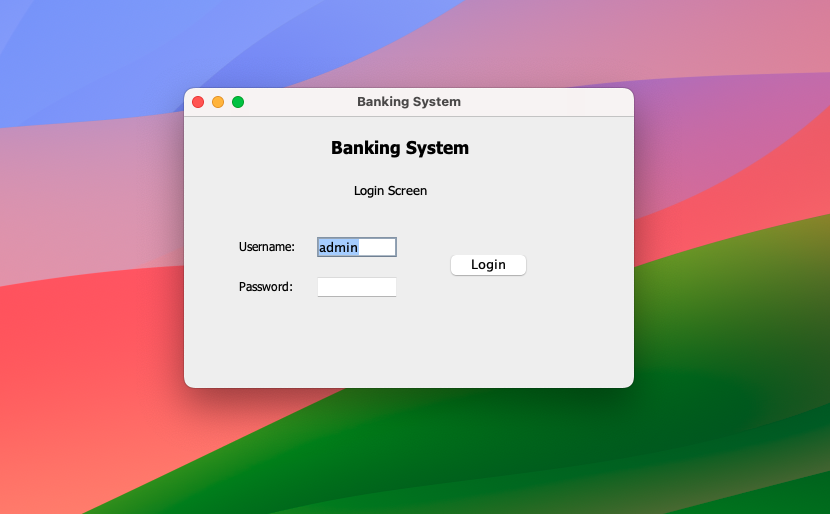

# SecureBank – Java Banking Management System

A desktop-based **Banking Management System** built with **Java and Java Swing**. The application provides a graphical interface for managing bank accounts and performing essential banking operations such as deposits, withdrawals, balance management, and account creation.

## 🚀 Features

* Create and manage bank accounts
* Support for multiple account types:

  * Savings Account
  * Current Account
  * Student Account
* Deposit money
* Withdraw money
* Check account balance
* Display account information
* Account validation and business-rule enforcement
* Custom exception handling
* Persistent data storage using Java Object Serialization
* User-friendly Java Swing graphical interface
* Login and menu-based navigation
* Transaction-related operations

## 🛠️ Technologies Used

* **Java**
* **Java Swing**
* **Object-Oriented Programming (OOP)**
* **Java Collections**
* **File I/O**
* **Object Serialization**
* **Exception Handling**
* **Git & GitHub**

## 🧠 OOP Concepts Implemented

The project demonstrates several core Object-Oriented Programming concepts:

* **Encapsulation** – Data and account operations are organized within classes.
* **Inheritance** – Different account types extend the common bank account structure.
* **Polymorphism** – Account-specific behavior is implemented through inherited classes.
* **Abstraction** – Common banking functionality is separated from account-specific implementations.
* **Custom Exceptions** – Banking rules and invalid operations are handled using custom exception classes.

## 📁 Project Structure

```text
SecureBank-Java-Banking-Management-System/
│
├── src/
│   ├── Application.java
│   │
│   ├── Bank/
│   │   ├── Bank.java
│   │   ├── BankAccount.java
│   │   ├── CurrentAccount.java
│   │   ├── SavingsAccount.java
│   │   └── StudentAccount.java
│   │
│   ├── Data/
│   │   └── FileIO.java
│   │
│   ├── Exceptions/
│   │   ├── AccNotFound.java
│   │   ├── InvalidAmount.java
│   │   ├── MaxBalance.java
│   │   └── MaxWithdraw.java
│   │
│   ├── GUI/
│   │   ├── Login.java
│   │   ├── Menu.java
│   │   ├── GUIForm.java
│   │   ├── AddAccount.java
│   │   ├── AddSavingsAccount.java
│   │   ├── AddCurrentAccount.java
│   │   ├── AddStudentAccount.java
│   │   ├── DepositAcc.java
│   │   ├── WithdrawAcc.java
│   │   └── DisplayList.java
│   │
│   └── img/
│       └── 1.png
│
├── bin/
├── data.bin
├── README.md
└── screenshot/
    ├── 1.png
    └── 2.png
```

## ▶️ How to Run

### Prerequisites

Make sure Java is installed:

```bash
java -version
javac -version
```

### Clone the Repository

```bash
git clone https://github.com/Dibyajyotisahu/SecureBank-Java-Banking-Management-System.git
cd SecureBank-Java-Banking-Management-System
```

### Compile the Project

The project uses `Application.java` as the main entry point.

On Windows PowerShell:

```powershell
javac -d bin src\Bank\*.java src\Data\*.java src\Exceptions\*.java src\GUI\*.java src\Application.java
```

### Copy GUI Resources

The application uses images from the `img` directory:

```powershell
Copy-Item -Recurse -Force src\img bin\
```

### Run the Application

```powershell
java -cp bin Application
```

## 💾 Data Persistence

SecureBank uses **Java Object Serialization** to persist banking data.

The application can store account information so that data can be retained between application sessions.

The generated data file is:

```text
data.bin
```

## 🖥️ Screenshots

### Login / Application Interface



### Banking Management Interface


## 🔐 Banking Operations

The system supports essential banking operations including:

### Account Management

Users can create different types of bank accounts according to the application's supported account rules.

### Deposit

Users can deposit money into an existing account while validating the transaction amount.

### Withdrawal

Users can withdraw money while applying account-specific withdrawal restrictions and validation rules.

### Balance Management

The application allows users to view and manage account balances through the graphical interface.

## ⚠️ Exception Handling

The project contains custom exceptions for handling invalid banking operations, including:

* `AccNotFound`
* `InvalidAmount`
* `MaxBalance`
* `MaxWithdraw`

These exceptions help enforce banking business rules and provide safer transaction processing.

## 🎯 Learning Objectives

This project demonstrates practical implementation of:

* Java OOP
* Java Swing GUI development
* Inheritance and polymorphism
* Custom exception handling
* File I/O
* Object serialization
* Desktop application development
* Basic banking business logic
* Git and GitHub version control

## 🔮 Future Improvements

Possible improvements include:

* MySQL/PostgreSQL database integration
* Password hashing and stronger authentication
* Transaction history database
* Improved UI/UX
* Admin dashboard
* Account statements
* Fund transfer functionality
* Unit and integration testing
* Maven/Gradle dependency management
* Improved validation and security

## 🤝 Contributing

Contributions are welcome.

1. Fork the repository.
2. Create a feature branch:

```bash
git checkout -b feature/new-feature
```

3. Commit your changes:

```bash
git add .
git commit -m "Add new feature"
```

4. Push the branch:

```bash
git push origin feature/new-feature
```

5. Open a Pull Request.

## 📄 License

This project is licensed under the MIT License.

## 👨‍💻 Author

**Dibyajyoti Sahu**

GitHub:
https://github.com/Dibyajyotisahu

Repository:
https://github.com/Dibyajyotisahu/SecureBank-Java-Banking-Management-System

## ⭐ Acknowledgments

* Java for the programming language and runtime environment.
* Java Swing for the desktop graphical user interface.
* The Java OOP ecosystem for supporting the application's banking architecture.

---

⭐ If you find this project useful, consider giving the repository a star!
